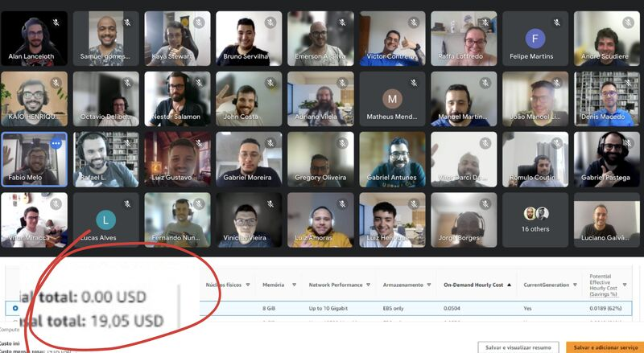
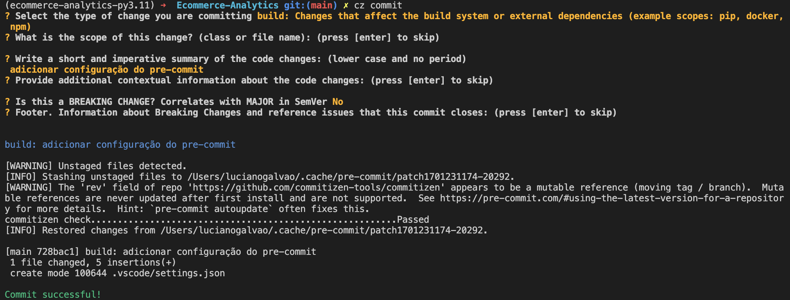
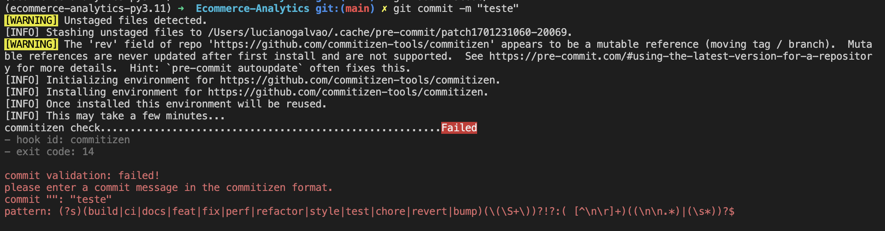

# Estruturando um DW pagando barato

Esse repositório foi construído durante o Workshop 03, que aconteceu no dia 17/12/2023, com o objetivo de estruturar um ambiente analítico avançado pagando pouco.



Bem-vindo ao workshop 03 que enfrenta o desafio empolgante de estruturar um ambiente analítico avançado para uma grande rede de supermercados. Com mais de 300 lojas físicas e uma presença robusta no e-commerce, esta rede busca uma solução de análise de dados que habilite a diretoria a tomar decisões informadas e estratégicas baseadas em dados reais e insights valiosos.

Para isso vamos construir um Lakehouse utilizando o Delta Lake, que é uma tecnologia open source, que combina os melhores aspectos dos Data Lakes e Data Warehouses, permitindo que os dados sejam armazenados em um formato colunar altamente otimizado, com suporte a ACID transactions, schema enforcement e versioning.

## Índice

- [Estruturando um DW pagando barato](#estruturando-um-dw-pagando-barato)
  - [Índice](#índice)
  - [Objetivo](#objetivo)
  - [Desafios e Considerações Econômicas](#desafios-e-considerações-econômicas)
  - [Motivação](#motivação)
  - [Desafio](#desafio)
  - [Como começar um projeto de DW?](#como-começar-um-projeto-de-dw)
  - [Decisões de negócio](#decisões-de-negócio)
    - [Qual será o business case?](#qual-será-o-business-case)
    - [Qual será a granularidade dos dados?](#qual-será-a-granularidade-dos-dados)
    - [Quais são minhas tabelas de fatos?](#quais-são-minhas-tabelas-de-fatos)
    - [Quais são minhas tabelas de dimensões?](#quais-são-minhas-tabelas-de-dimensões)
  - [Decisões técnicas de arquitetura](#decisões-técnicas-de-arquitetura)
    - [Quais são minhas fontes de dados?](#quais-são-minhas-fontes-de-dados)
    - [Como definir soluções de ingestão](#como-definir-soluções-de-ingestão)
    - [Transformação](#transformação)
    - [Catalog](#catalog)
    - [Storage](#storage)
    - [Quais produtos vou querer?](#quais-produtos-vou-querer)
  - [Desafio Técnico](#desafio-técnico)
  - [Estrutura do projeto](#estrutura-do-projeto)
    - [Explicação da Estrutura:](#explicação-da-estrutura)
  - [AWS](#aws)
    - [Notas de Segurança:](#notas-de-segurança)
  - [Pre-commit](#pre-commit)
    - [Commites semânticos e pre-commit](#commites-semânticos-e-pre-commit)

## Objetivo

Nosso principal objetivo é fornecer uma visão holística e detalhada do desempenho de vendas, respondendo a questões cruciais como:

* **Análise de Receita Total**: Compreender a receita total gerada pela rede, um indicador vital para o sucesso do negócio.
* **Desempenho por Segmento**: Avaliar a receita gerada por cada loja individualmente e pelo canal digital, identificando áreas de força e oportunidades de crescimento.
* **Categorias de Produto**: Analisar a receita gerada por cada categoria de produto, oferecendo insights sobre preferências de consumo e tendências de mercado.
* **Impacto das Promoções**: Quantificar como as promoções afetam a receita total, essencial para estratégias de marketing eficazes.
* **Margem de Lucro**: Avaliar a lucratividade da rede, um indicador chave para a saúde financeira do negócio.

Além disso, visamos construir uma plataforma de dados que permita aos times de negócio desenvolver dashboards e relatórios personalizados, fomentando uma cultura data-driven e autossuficiente na empresa.

## Desafios e Considerações Econômicas

Este projeto não é apenas uma jornada técnica, mas também um exercício de eficiência de custos. A diretoria está comprometida com uma solução econômica que maximize o retorno sobre o investimento. Portanto, estamos focados em implementar uma estratégia que equilibre o desempenho, a escalabilidade e a acessibilidade financeira.


## Motivação

Você não precisa de PySpark, Databricks, Snowflake, Redshift, Fabric, etc. Você quer gerar valor, porém pagando pouco. 99% dos projetos não precisam dessas soluções e você sabe disso.

## Desafio

Neste projeto, vamos montar um DW com as seguintes características:

- Operação de uma grande rede de supermercados com 300 lojas e um Ecommerce
- Ingestão de dados com vendas das lojas físicas totalizando 1 milhão de linhas diárias
- Ingestão de dados via API com vendas do Ecommerce a cada hora
- Ingestão da dados via Excel com catalogo de produtos atualizado a cada 3 dias

## Como começar um projeto de DW?

## Decisões de negócio

### Qual será o business case?

### Qual será a granularidade dos dados?

### Quais são minhas tabelas de fatos?

### Quais são minhas tabelas de dimensões?

## Decisões técnicas de arquitetura

### Quais são minhas fontes de dados?

### Como definir soluções de ingestão

### Transformação

### Catalog

### Storage

### Quais produtos vou querer?


## Desafio Técnico

## Estrutura do projeto

A estruturação de pastas em um projeto de Data Warehouse (DW) é crucial para manter o projeto organizado, escalável e gerenciável. Aqui está uma estrutura de pastas recomendada, considerando um projeto de DW que utiliza DuckDB para processamento e armazenamento de dados na AWS com Delta Lake, e que lida com várias fontes de dados como bancos de dados PostgreSQL, APIs e arquivos Excel:

```graphql
data-warehouse-project/
│
├── data/
│   ├── raw/              # Dados brutos extraídos das fontes
│   ├── interim/          # Dados em processo de transformação
│   └── processed/        # Dados transformados prontos para serem carregados no DW
│
├── notebooks/            # Jupyter notebooks para exploração e análise de dados
│
├── scripts/
│   ├── etl_scripts/      # Scripts para processos ETL
│   │   ├── extract/      # Scripts para extração de dados
│   │   ├── transform/    # Scripts para transformação de dados
│   │   └── load/         # Scripts para carregar dados no DW
│   └── utility_scripts/  # Scripts utilitários (ex.: conexão com APIs, funções auxiliares)
│
├── sql/
│   ├── queries/          # Consultas SQL para análises e relatórios
│   └── ddl/              # Scripts SQL para definição de esquema (DDL)
│
├── config/               # Arquivos de configuração (ex.: conexões de banco de dados, variáveis de ambiente)
│
├── logs/                 # Logs de execução dos scripts ETL
│
├── tests/                # Testes automatizados (ex.: testes de integridade de dados)
│
├── docker/               # Arquivos Docker para criar ambientes de execução consistentes
│
└── docs/                 # Documentação do projeto
    ├── data_dictionary/  # Dicionário de dados descrevendo as fontes de dados e modelos
    └── etl_documentation/ # Documentação dos processos ETL
```

### Explicação da Estrutura:

* **data/**: Armazena os dados em diferentes estágios do processo ETL. É importante manter uma separação clara entre dados brutos, dados em processo e dados processados.
* **notebooks/**: Para análises exploratórias e prototipagem rápida.
* **scripts/**: Contém os scripts ETL e scripts auxiliares.
* **sql/**: Armazena consultas e definições SQL.
* **config/**: Configurações gerais e sensíveis, como chaves de API, não devem ser versionadas.
* **logs/**: Para rastrear eventos e erros que ocorrem durante a execução dos scripts.
* **tests/**: Testes são essenciais para garantir a qualidade dos dados e a robustez do código.
* **docker/**: Facilita a criação de ambientes consistentes, especialmente útil em equipes grandes ou para implantações em produção.
* **docs/**: Documentação é vital para a manutenção e escalabilidade do projeto.

Esta estrutura pode ser ajustada conforme as necessidades específicas do seu projeto. É importante manter uma abordagem modular e flexível para acomodar mudanças e expansões futuras do projeto.

Literatura recomendada:

- [Big Data is Dead | MotherDuck](https://www.youtube.com/watch?v=lisIQ9ohU8g)
- [dbt-core and duckdb | Medium](https://medium.com/datamindedbe/use-dbt-and-duckdb-instead-of-spark-in-data-pipelines-9063a31ea2b5)

## AWS

Vamos utilizar o serviço S3 da AWS para armazenar os dados brutos e processados. Para isso, você precisa criar uma conta na AWS e configurar as credenciais de acesso no seu projeto local.

Para encontrar as informações necessárias, como `AWS_ACCESS_KEY_ID`, `AWS_SECRET_ACCESS_KEY` e o nome do seu bucket S3 na AWS (Amazon Web Services), você pode seguir estes passos:

1. **AWS_ACCESS_KEY_ID e AWS_SECRET_ACCESS_KEY**

Essas credenciais são parte das suas chaves de acesso da AWS. Para obtê-las, você deve criar ou usar uma chave de acesso existente no IAM (Identity and Access Management) da AWS. Veja como:

  Faça login no [Console de Gerenciamento da AWS](https://aws.amazon.com/console/).
* Navegue até o serviço IAM.
* No painel de navegação, escolha "Usuários".
* Escolha o seu usuário IAM (ou crie um novo usuário se necessário).
* Na aba "Credenciais de segurança", você pode criar uma nova chave de acesso. Ao criar uma nova chave, você receberá o `AWS_ACCESS_KEY_ID` e o `AWS_SECRET_ACCESS_KEY`. Lembre-se de baixar e guardar essas chaves em um lugar seguro, pois o `AWS_SECRET_ACCESS_KEY` não pode ser recuperado depois de criado.

2. **Nome do Bucket S3**

Para encontrar o nome do seu bucket S3:

* Faça login no [Console de Gerenciamento da AWS](https://aws.amazon.com/console/).
* Navegue até o serviço Amazon S3.
* Você verá uma lista de buckets S3. Procure pelo bucket que deseja usar e copie o nome exato.

3. **Configuração do Arquivo `.env`**

Após obter essas informações, você pode configurar o arquivo `.env` no seu projeto local da seguinte forma:

```makefile
AWS_ACCESS_KEY_ID=sua_access_key_id
AWS_SECRET_ACCESS_KEY=sua_secret_key
S3_BUCKET_NAME=nome_do_seu_bucket
```

### Notas de Segurança:

* **Nunca** compartilhe suas chaves de acesso (`AWS_ACCESS_KEY_ID` e `AWS_SECRET_ACCESS_KEY`) publicamente ou as inclua no controle de versão do seu código (como em repositórios Git).
* Considere atribuir políticas de permissão mínimas necessárias ao usuário IAM para aumentar a segurança. Por exemplo, se o usuário só precisa acessar determinados buckets S3, configure suas permissões para limitar o acesso apenas a esses recursos.
* Regularmente revise e gire suas chaves de acesso para manter a segurança da sua conta AWS.

## Pre-commit

### Commites semânticos e pre-commit

1) Trabalhar com commites semânticos (como Conventional Commits)

O que NÃO são commits semânticos:

```bash
git commit -m "first commit"
git commit -m "arrumei alguns arquivos,  vai funcionar agora"
git commit -m "agora vai… arrumei mais coisas, mas agora compila"
```

O problema com esses commits é que eles não dizem nada sobre o que foi feito. Eles não são úteis para ninguém que não seja o autor do commit, e mesmo assim, só serão úteis por um curto período de tempo.

Motivos para usar:
Commits semânticos são uma convenção para adicionar metadados (valor) aos commits. Para ele seja útil para outros usuários, para o próprio autor e para o projeto de maneira geral. Em outras palavras, o commit semântico é uma forma de padronizar os commits, para que eles sejam úteis para o projeto. No longo prazo, isso vai facilitar a manutenção do projeto, e vai ajudar a entender o que foi feito em cada commit, diminuir o tempo de onboarding de novos desenvolvedores, e facilitar a busca por bugs.

Motivos para não usar:
Preguiça, falta de conhecimento, falta de tempo, falta de disciplina, etc.
 
O formato é o seguinte:
```bash
<tipo>: <descrição>
```

Os tipos disponíveis são:
- feat: nova funcionalidade
- fix: correção de bug
- docs: alteração na documentação
- style: formatação de código, ponto e vírgula faltando, etc; - não altera o significado
- refactor: refatoração de código, sem alterar a semântica
- test: adição ou correção de testes
- chore: alterações no processo de build, atualização de - dependências, etc; não altera o código em si

Exemplo 1: 
```bash
feat: acidicionado camada de Delta Lake
```

Exemplo 2:
```bash
fix: corrigido bug de escrita no Delta Lake
```

Exemplo 3:
```bash
docs: adicionado documentação sobre Delta Lake
```

O grande desafio é fazer com que todos os desenvolvedores sigam essa convenção. Para isso, vamos automatizar o processo de commit, utilizando o [Commitizen](https://github.com/commitizen-tools/commitizen) e uma ferramenta de [pre-commit](https://pre-commit.com/) para garantir que os commits sejam feitos de acordo com a convenção.

Para instalar o Commitizen, vamos utilizar o [Poetry](https://python-poetry.org/)

```bash
poetry add commitizen --group dev
```

Na maior parte do tempo só vamos usar o comando `cz commit` para fazer os commits

```bash
cz commit
```

Para garantir que não vamos esquecer do commit semantico, vamos utilizar o [pre-commit](https://pre-commit.com/)

```bash
poetry add pre-commit --group dev
```

Para configurar o pre-commit, vamos criar um arquivo `.pre-commit-config.yaml` na raiz do projeto, com o seguinte conteúdo:

```yaml
repos:
  - repo: https://github.com/commitizen-tools/commitizen
    rev: master
    hooks:
      - id: commitizen
        stages: [commit-msg]
```

Para instalar os hooks do pre-commit, vamos executar o seguinte comando:

```bash
pre-commit install --hook-type commit-msg
```

Agora, sempre que executarmos o comando `cz commit`, vamos ser guiados para fazer o commit semântico.



Se tentarmos fazer um commit sem ser semântico, vamos receber uma mensagem de erro



Dessa forma, garantimos que todos os commits vão seguir a convenção, e que os commits vão ser úteis para o projeto.

Módulos Faker: Simulando um Banco de Transações de um POS
Dentro deste projeto, desenvolvemos um conjunto de módulos chamados faker que têm como objetivo simular um banco de transações de um Ponto de Venda (POS - Point of Sale). Esses módulos são essenciais para criar dados de transações de vendas realistas e volumosos, que são cruciais para testar e desenvolver nosso Data Warehouse (DW) de forma eficaz. Vamos dar uma olhada em como esses módulos funcionam e por que eles são importantes.

O Que São os Módulos Faker?
Os módulos faker são componentes do projeto que geram dados fictícios de transações de vendas que se assemelham a transações reais em um ambiente de varejo. Eles são responsáveis por criar registros de vendas, incluindo informações como:

Data e hora da transação.
Itens comprados.
Quantidades de itens.
Preços unitários.
Forma de pagamento.
Informações do cliente (geralmente anonimizadas).
Por Que São Importantes?
Testes de Desempenho e Escalabilidade: Para garantir que nosso DW possa lidar com grandes volumes de dados, precisamos de dados de teste realistas. Os módulos faker nos permitem criar milhões de transações fictícias, o que é essencial para testar o desempenho e a escalabilidade do DW.

Desenvolvimento e Depuração: Durante o desenvolvimento do DW, é fundamental ter dados de teste que simulem situações do mundo real. Os módulos faker nos ajudam a criar dados de transações que podem ser usados para depurar e verificar a funcionalidade do DW.

Confidencialidade dos Dados: Trabalhar com dados reais de transações pode ser problemático devido a preocupações com privacidade e confidencialidade dos clientes. Os dados gerados pelos módulos faker são completamente fictícios e não representam informações reais de clientes ou transações, o que elimina preocupações de confidencialidade.

Flexibilidade de Testes: Os módulos faker são altamente configuráveis, permitindo que ajustemos diversos parâmetros, como a taxa de geração de transações, o intervalo de datas e os tipos de produtos. Isso nos dá a flexibilidade de criar cenários de teste específicos conforme necessário.

Utilização dos Módulos Faker
Os módulos faker podem ser chamados a partir de scripts e processos de ETL para gerar registros de transações fictícias. Eles fornecem uma API simples para configurar os parâmetros de geração de dados, como a quantidade de transações desejadas, a faixa de datas para as transações e os tipos de produtos a serem incluídos nas transações.

A utilização desses módulos é crucial para garantir que nosso DW seja robusto, eficiente e capaz de atender às necessidades de análise de dados da empresa.

No geral, os módulos faker desempenham um papel fundamental na simulação de um ambiente realista de transações de vendas, permitindo-nos desenvolver, testar e depurar nosso DW de forma eficaz, ao mesmo tempo em que protegem a privacidade dos clientes e a confidencialidade dos dados.